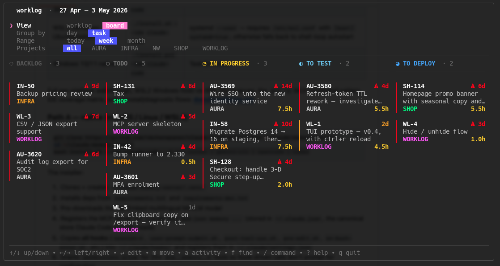
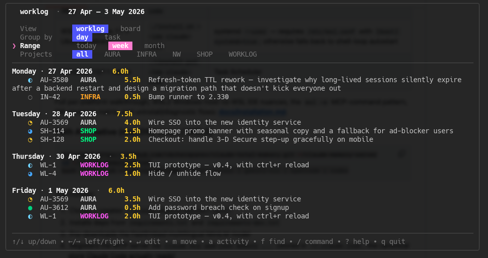
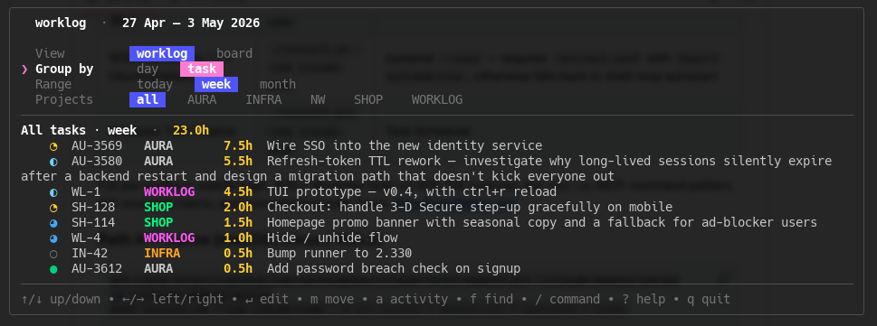

# worklog

A personal sidecar to whatever ticket tracker your team lives in. Keeps a
small local log of what you did, what's still open, and where the hours
went — for the repos and side experiments that don't fit the official
board, and the "what was I doing on Tuesday?" moments.

TUI for browsing, CLI for one-shot logging, MCP server so Claude can read
and write the same SQLite file:

> log 2h on AU-3569 today, was testing the refresh flow



Two more views of the same data — by day and by task, scoped to the current week:





---

## Install

Pure Go, no CGO (uses `modernc.org/sqlite`). Requires Go 1.26+.

### Quick install (recommended)

Builds the binary and wires it into your MCP client in one go:

```sh
git clone https://github.com/snezhinskiy/worklog && cd worklog
bash install.sh --client claude-code      # or: claude-desktop | none
```

This:

- builds `worklog` and drops it in `$(go env GOPATH)/bin`
- registers the `worklog` MCP server at user scope (so it's available in
  every project, not just this repo)
- backs up your Claude Desktop config before patching it

Verify:

```sh
worklog --version
```

If `$(go env GOPATH)/bin` isn't in your `$PATH` yet, the script will tell
you the line to add to `~/.zshrc` / `~/.bashrc`.

<details>
<summary>Manual install (no script)</summary>

#### Build the binary

Either `go install`:

```sh
go install github.com/snezhinskiy/worklog/cmd/worklog@latest
```

…or from source:

```sh
git clone https://github.com/snezhinskiy/worklog && cd worklog
go build -o worklog ./cmd/worklog
mv worklog /usr/local/bin/   # or anywhere on your $PATH
```

#### Wire into Claude Code

```sh
claude mcp add worklog -s user -- "$(which worklog)" mcp
claude mcp list   # should show 'worklog'
```

#### Wire into Claude Desktop

Edit the config (paths: macOS `~/Library/Application Support/Claude/claude_desktop_config.json`,
Windows `%APPDATA%\Claude\claude_desktop_config.json`,
Linux `~/.config/Claude/claude_desktop_config.json`) and add a `worklog`
entry under `mcpServers`:

```json
{
  "mcpServers": {
    "worklog": {
      "command": "/absolute/path/to/worklog",
      "args": ["mcp"]
    }
  }
}
```

Restart Claude Desktop.

</details>

The result is one binary that hosts every entry point: TUI, CLI
subcommands, and the MCP server.

---

## First run

```sh
worklog
```

On first launch it creates `~/.local/share/worklog/worklog.db` (XDG-aware;
honours `$XDG_DATA_HOME`) and opens an empty TUI — no sample data is
written. Add a project and start logging via the TUI, the CLI, or MCP.

Useful flags:

- `--seed` — populate the DB with sample projects, tasks, logs, and activities (handy for kicking the tyres before adding real data).
- `--reset` — delete the DB file (and its WAL sidecars) before opening. Combine with `--seed` to start over from samples.
- `--demo` — skip the DB entirely and render in-memory mocks (for screenshots).
- `--db <path>` — point at a different SQLite file.

---

## Config

Optional. Drop [`examples/config.toml`](examples/config.toml) into
`~/.config/worklog/config.toml` (or `$XDG_CONFIG_HOME/worklog/config.toml`)
and tweak. Every field has a built-in default — leave out anything you
don't care about.

| Section                  | What it controls                                                                 |
| ------------------------ | -------------------------------------------------------------------------------- |
| `[ui]`                   | starting view (`worklog` / `board`), `day_target_hours`, border style            |
| `[ui.colors]`            | palette (256-color ANSI codes) — accent, text, hours, chip backgrounds, …        |
| `[keys]`                 | rebind single-key shortcuts (`reload`, `palette`, `move`, `activity`, `find`, …) |
| `[stale]`                | board staleness thresholds — `warn_days` (orange), `alert_days` (red + ⚠)        |
| `[stale_per_status.<k>]` | override staleness per status (e.g. `in_progress` should go red faster)          |
| `[[status]]`             | full workflow — define your own statuses; `on_board = true` puts them on board   |
| `[project_colors]`       | per-project tint, keyed by slug (e.g. `INFRA = "214"`)                           |

A few notes:

- **Statuses are all-or-nothing.** Declaring even one `[[status]]` block
  fully replaces the default list. Order in the file = column order on
  the board = cycle order of `←/→` in the editor.
- **Key names** are bubbletea names — `"ctrl+r"`, `"alt+m"`, `"f1"` all work.
- **Colors** are 256-color ANSI codes. [Reference chart](https://en.wikipedia.org/wiki/ANSI_escape_code#8-bit).
- Changes apply on next launch — there's no live reload of the config file.

---

## MCP server

Once registered (see install above), Claude can read your tasks, log work,
change statuses, and add merge-request links — all of which stay synced
with the TUI. Try:

> what's on my plate this week?

### Other MCP clients

Anything that speaks MCP over stdio works — just point it at `worklog mcp`.
Confirmed: Claude Code, Claude Desktop. Should also work with Cursor,
Continue.dev, and any custom client built on the MCP SDK.

### Available tools (24)

- **projects** — `project_list`, `project_create`, `project_update`,
  `project_set_hidden`, `project_delete`
- **tasks** — `task_list`, `task_create`, `task_update`, `task_rename`,
  `task_set_status`, `task_set_hidden`, `task_delete`
- **logs** — `log_list`, `log_create`, `log_update`, `log_set_hidden`,
  `log_delete`
- **activities** — `activity_list`, `activity_create`, `activity_update`,
  `activity_set_hidden`, `activity_delete`
- **reports** — `report_day`, `pending_tasks`

> The TUI doesn't auto-detect external mutations — press `ctrl+r` after
> Claude edits something to refresh the view.

---

## Four primitives

| Thing      | What it is                                                        |
| ---------- | ----------------------------------------------------------------- |
| `project`  | A slug like `AURA` that groups tasks                              |
| `task`     | Something to do; has a status (`todo` → `in_progress` → …)        |
| `log`      | A unit of work spent on a task on a date, with a note             |
| `activity` | A typed event on a task: `mr`, `commit`, `deploy`, `link`, `note` |

Tasks get auto-generated IDs from the project's `task_prefix` (e.g.
`WORKLOG` with `task_prefix = "WL"` yields `WL-1`, `WL-2`, …). When a
`task_prefix` isn't set, the slug is used. You can also pass an explicit
`external_id` at creation when adopting a Jira/Linear ticket id.

---

## TUI keys

Press `?` inside the TUI for the full list. The defaults:

| Key            | Action                                            |
| -------------- | ------------------------------------------------- |
| `↑/↓ ←/→`      | navigate cursor / chips                           |
| `tab`          | next focus area                                   |
| `↵`            | edit the row under the cursor                     |
| `→`            | expand a task to walk its individual log lines    |
| `v g r p`      | cycle view / group / range / project filter       |
| `m`            | move task under cursor to a different status      |
| `a`            | add a typed activity (mr/commit/deploy/link/note) |
| `f`            | find / filter the body live                       |
| `/`            | command palette                                   |
| `ctrl+r`       | reload from disk (sync changes from MCP / CLI)    |
| `i`            | about                                             |
| `q · ctrl+c`   | quit                                              |

All single-key shortcuts are configurable under `[keys]` in `config.toml`.

---

## CLI

```sh
worklog                                  # launch TUI (alias: worklog open)
worklog log AU-3569 1.5h "fixed migration"
worklog today                            # day summary
worklog pending                          # what's still on your plate
worklog status AU-3569 in_progress       # change status
worklog rename AU-3569 NEW-1             # rename task id (cascades to logs)
worklog hide task AU-3569                # soft-hide (with --no-cascade)
worklog unhide task AU-3569
worklog export --range week --notes      # plain-text report → stdout
worklog activity add AU-3569 mr --url https://… --text "auth refactor"
worklog activity list --task AU-3569
worklog mcp                              # speak MCP over stdio
worklog version                          # print version
```

Flags can come before or after positional args (`worklog activity add AU-3569 mr --url …` works).

---

## Hide vs delete

`*_set_hidden` is the soft path: a `WHERE archived = 0` predicate hides the
row from default reads (lists, search, reports), but it's still in the DB
and can be brought back with `hidden = false`. Hiding a task or project
cascades to its children by default (`no_cascade = true` opts out).

`*_delete` is the hard escape hatch — irreversible. Tasks delete-cascade to
their logs and activities; projects refuse to delete while any task still
references them.

---

## Layout

```
cmd/worklog/         # main + CLI subcommands + mcp dispatcher
internal/domain/     # pure-Go types + Store interface + validators
internal/store/      # SQLite implementation of domain.Store (no CGO via modernc.org/sqlite)
internal/memstore/   # in-memory implementation (used by tests)
internal/tui/        # bubbletea TUI (model.go, update.go, nav.go, snapshot.go, …)
internal/mcpsrv/     # MCP server (modelcontextprotocol/go-sdk)
internal/report/     # plain-text day/week/month rendering
internal/config/     # TOML config + defaults
examples/            # config.toml example
```

---

## License

MIT. See `LICENSE`.
